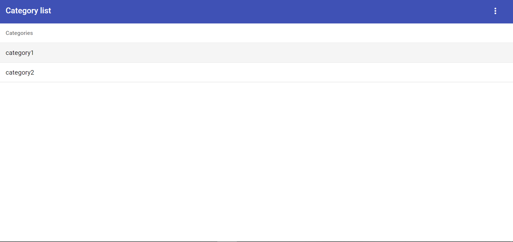
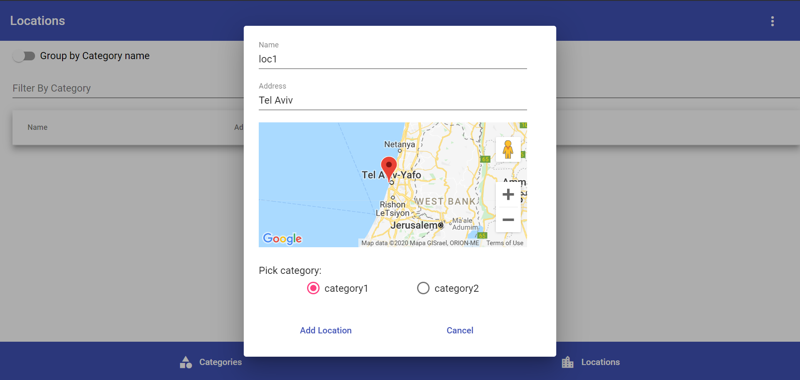
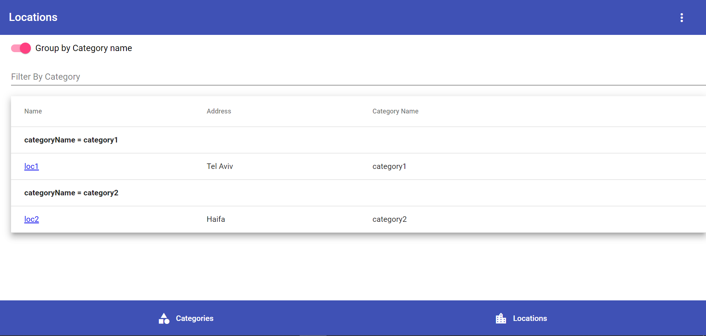
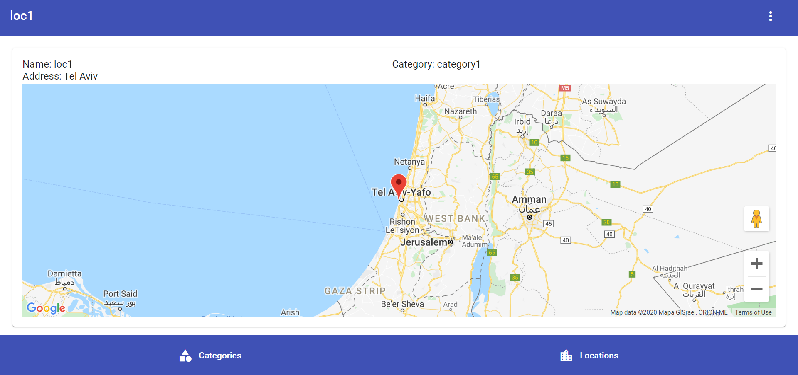

# My Locations Applcation

Demo: http://pacific-spire-36644.herokuapp.com/

## Getting Started

Run `npm run start:dev` to debug locally

**Features**:
* Developed with Angular 8 + Typescript
* CRUD application of categories.
* categories is saved into local storage.
* Use of angular material + flex layout.
* Use of RxJs(reactive programming).

**TODO**:
* Add grouping to grid
* Add validations to forms
* change agm-map to @angular/maps
* Lazy loading for locations and categories components

Images:

