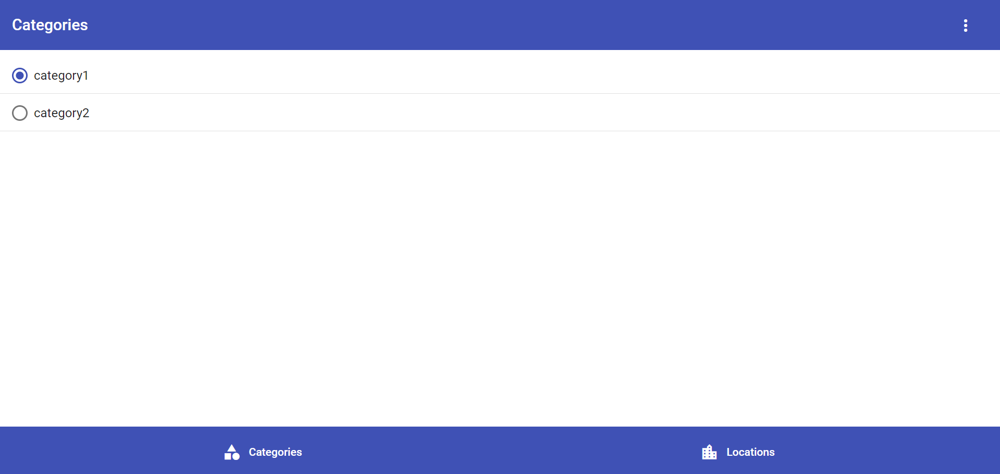

# My Locations Application

Website that shows locations by category.
Demo: http://pacific-spire-36644.herokuapp.com/

## Getting Started

Run `npm run start:dev` to debug locally

## Features

* Developed with Angular 9 + Typescript.
* CRUD angular application that works with the local storage.
* Use of angular material.
* Use of flex layout.
* Use of RxJs(reactive programming).
* Use of agm-map library(google maps).
* Use of feature lazy loading.
* Use of reactive forms.

## Images

